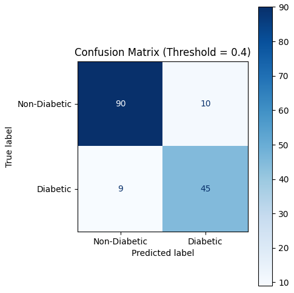
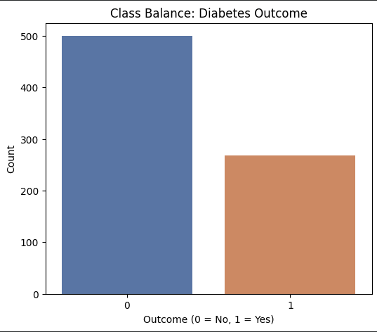
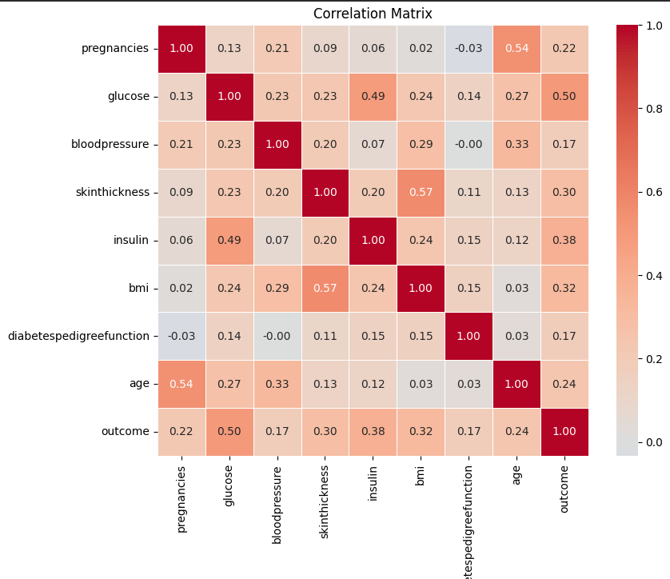
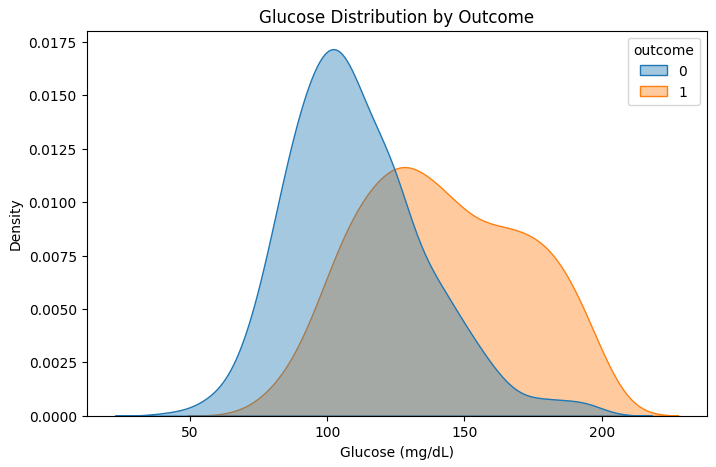
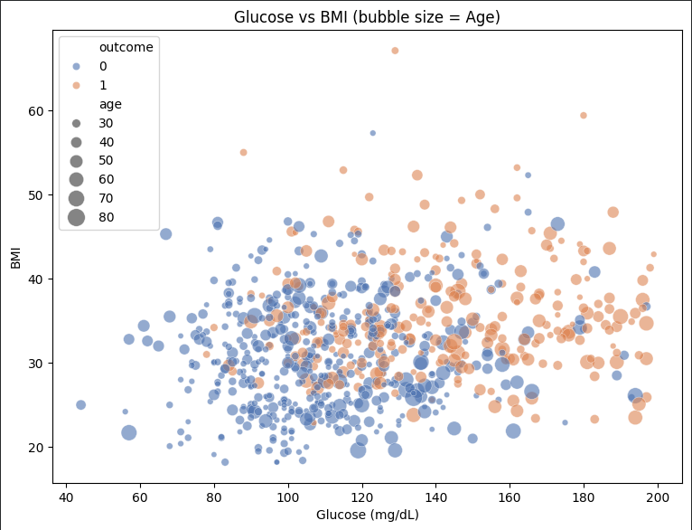
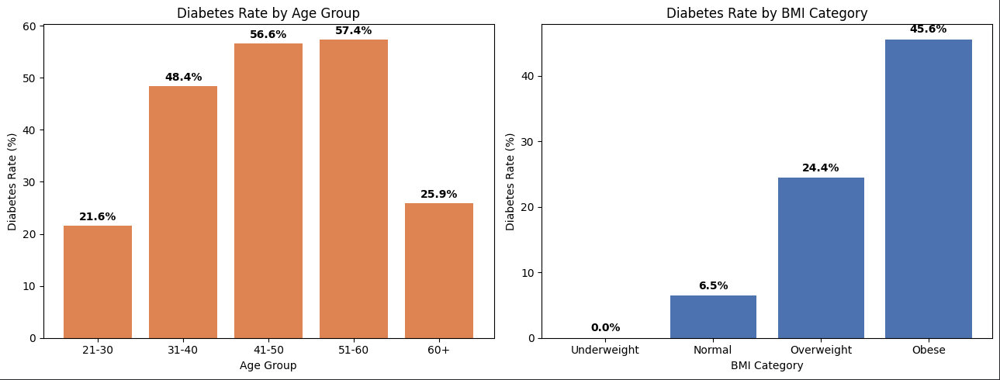

# Diabetes Risk Predictor

A personal machine learning project predicting diabetes risk using real-world clinical data.

## Why This Matters

Diabetes is one of the fastest-growing health crises in the world today, and South Asia is at the center of it. India alone has the second-highest number of diabetes cases globally, and the trend is accelerating — driven by lifestyle changes, urbanization, and genetic predisposition in South Asian populations. Early risk prediction tools, even simple ones, play a real role in encouraging people to seek proper clinical testing before the disease progresses.

This project explores whether a machine learning model can meaningfully predict diabetes risk using basic clinical measurements — the kind of data that's realistically available in a routine checkup.

## Dataset

The Pima Indians Diabetes Dataset — a real, widely-used clinical dataset containing diagnostic measurements (glucose, BMI, blood pressure, insulin, age, etc.) collected from adult female patients, with a binary outcome indicating diabetes diagnosis.

## What I Did

**Data Inspection & Cleaning**
Checked the data for structural issues and known data quality problems — several columns (glucose, blood pressure, skin thickness, insulin, BMI) use `0` as a placeholder for missing values rather than a true zero measurement, which was identified and addressed before modeling.

**Exploratory Data Analysis**
Used matplotlib and seaborn to explore class balance, feature correlations, and how key clinical markers like glucose and BMI relate to diabetes outcome.

**Feature Scaling**
Applied `RobustScaler` to numeric features — chosen specifically because it's less sensitive to outliers than standard scaling, which matters given the skewed distributions in this dataset.

**Preprocessing Pipeline**
Built a `ColumnTransformer` to handle preprocessing consistently, then wrapped it inside a single `Pipeline` alongside the model — ensuring the exact same transformations apply during training, testing, and any future predictions.

**Model Comparison**
Trained and compared five models via 5-fold stratified cross-validation:
- MLP (Neural Network)
- Random Forest
- HistGradientBoosting
- XGBoost
- CatBoost

CatBoost was selected as the final model — it delivered the best overall balance of precision and recall compared to the others.

**Hyperparameter Tuning**
Tuned CatBoost's parameters to improve generalization.

**Threshold Tuning**
Rather than relying on the default 0.5 classification cutoff, I tested a range of thresholds and selected the one that gave the best precision/recall balance. This chosen threshold was built directly into the model's prediction logic, so it's applied automatically every time the model makes a prediction — no manual adjustment needed downstream.

## Results (Held-Out Test Set)

| Metric | Score |
|---|---|
| Accuracy | 0.88 |
| Precision | 0.82 |
| Recall | 0.83 |
| F1 Score | 0.83 |
| ROC-AUC | 0.95 |

### Confusion Matrix


## Exploratory Visuals

**1. Target Class Balance**


**2. Correlation Heatmap**


**3. Glucose Distribution by Outcome**


**4. Glucose vs BMI (bubble size = Age)**


**5. Diabetes Rate by Age Group and BMI Category**



## Tech Stack

Python, pandas, NumPy, scikit-learn, CatBoost, matplotlib, seaborn


<h2><a class="anchor" id="project-structure"></a>📁 Project Structure</h2>

```
Predictive-maintenance/
│
├── data/
│   └── diabetes.csv
│
├── images/
│   ├── 01_target_balance.PNG
│   ├── 02_correlation_heatmap.PNG
│   └── 03_glucose_distribution.PNG
│   ├── 04_glucose_bmi_scatter.PNG
│   ├── 05_diabetes_rate_age_bmi.PNG
│   └── confusion_matrix.PNG
│
├── model/
│   └── catboost_diabetes_model.joblib
│
├── notebook/
│   └── diabetes_risk_predictor.ipynb
│
├── requirements.txt
└── README.md
```
> Adjust folder/file names above to match your actual repo layout.

---


